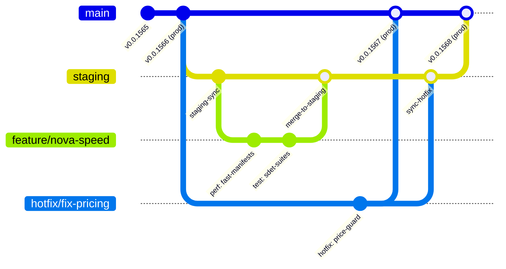

# 🛡️ RUNBOOK DE ESTRATEGIA DE BRANCHING, MITIGACIÓN Y ROLLBACK

> **Manual Canónico de Gestión de Ramas, Control de Versiones, Recuperación ante Desastres y Reglas de Inmutabilidad para Desarrolladores e IA**  
> *Smart Logistics Portal (smart-portal-1 & smart-portal-2)*

---

## 1. Filosofía de Arquitectura y Tolerancia Cero a Fallos

El sistema logístico de **Smart Logistics** procesa manifiestos aéreos y marítimos, liquidación de facturas, cálculo automático de tarifas y rutas de entrega de última milla en tiempo real. 

Para garantizar **disponibilidad continua, cero pérdida de datos y reversibilidad instantánea en caso de incidentes**, se establece una estrategia de branching estructurada tipo **Trunk-Based Híbrido con Release Trains y Canales de Hotfix Aislados**.

---

## 2. Topología de Ramas y Jerarquía de Entornos

```
┌────────────────────────────────────────────────────────────────────────────────────────┐
│                              JERARQUÍA DE RAMAS GIT                                    │
├───────────────┬──────────────────────┬─────────────────────────┬───────────────────────┤
│ Rama          │ Propósito            │ Despliegue Automático   │ Nivel de Protección   │
├───────────────┼──────────────────────┼─────────────────────────┼───────────────────────┤
│ `main`        │ Producción (Canon)   │ Hosting Oficial (Prod)  │ 🔒 Protegida / No Push│
├───────────────┼──────────────────────┼─────────────────────────┼───────────────────────┤
│ `staging`     │ Pre-producción / QA  │ Entorno de Staging      │ 🔒 Protegida / PR     │
├───────────────┼──────────────────────┼─────────────────────────┼───────────────────────┤
│ `feature/*`   │ Nuevas Funcionalidades│ Local / CI Runners     │ 🔓 Libre para Dev/AI  │
├───────────────┼──────────────────────┼─────────────────────────┼───────────────────────┤
│ `fix/*`       │ Correcciones Menores │ Local / CI Runners      │ 🔓 Libre para Dev/AI  │
├───────────────┼──────────────────────┼─────────────────────────┼───────────────────────┤
│ `hotfix/*`    │ Incidentes Críticos  │ Staging -> Prod Inmediato│ ⚡ Vía Rápida         │
├───────────────┼──────────────────────┼─────────────────────────┼───────────────────────┤
│ `release/*`   │ Congelamiento Release│ QA Pre-Deploy           │ 🔒 Temporal           │
└───────────────┴──────────────────────┴─────────────────────────┴───────────────────────┘
```

---

## 3. Diagrama Visual del Flujo de Ramas (Git Lifecycle)



---

## 4. Workflows de Desarrollo y Operación (Paso a Paso)

### 🚀 Workflow 1: Ciclo de Desarrollo Normal (Feature / Fix)

1. **Crear rama desde `main` actualizado**:
   ```bash
   git checkout main
   git pull origin main
   git checkout -b feature/nueva-funcionalidad
   ```
2. **Desarrollar y aplicar pruebas SDET locales**:
   ```bash
   # Ejecutar suite de pruebas local
   pnpm test
   ```
3. **Triple Verificación de Calidad Pre-Merge**:
   ```bash
   pnpm test        # 100% de tests en verde
   pnpm typecheck   # 0 errores TypeScript
   pnpm build       # Build de producción sin errores
   ```
4. **Promoción a `staging` para validación de QA**:
   ```bash
   git checkout staging
   git pull origin staging
   git merge --no-ff feature/nueva-funcionalidad
   git push origin staging
   ```
5. **Promoción Final a `main` y Release**:
   ```bash
   git checkout main
   git pull origin main
   git merge --no-ff staging
   node scripts/deploy/increment-version.js
   # Ejecutar despliegue oficial
   ```

---

### 🚨 Workflow 2: Hotfix Crítico de Producción (Emergency Fast-Track)

Cuando ocurre un incidente que requiere reparación inmediata en producción sin esperar al ciclo de `staging`:

1. **Crear rama de hotfix directamente desde `main`**:
   ```bash
   git checkout main
   git pull origin main
   git checkout -b hotfix/reparacion-critica
   ```
2. **Aplicar la corrección mínima y agregar test de regresión**:
   - Modificar el código fuente.
   - Crear o actualizar el `.spec.ts` correspondiente que demuestre la resolución del fallo.
3. **Verificación Estricta**:
   ```bash
   pnpm test && pnpm typecheck && pnpm build
   ```
4. **Merge a `main`, Tagging y Despliegue Inmediato**:
   ```bash
   git checkout main
   git merge --no-ff hotfix/reparacion-critica
   node scripts/deploy/increment-version.js
   
   # Crear tag inmutable
   NEW_TAG=$(node -p "require('./package.json').version")
   git tag -a "v$NEW_TAG" -m "Hotfix Release v$NEW_TAG"
   
   # Actualizar tag flotante prod
   git tag -f prod
   git push origin main --tags
   git push origin prod --force
   
   # Despliegue a Firebase Hosting
   npx firebase deploy --only hosting:smart-portal-admin --project smart-portal-admin
   ```
5. **Retro-Merge Obligatorio a `staging` (Anti-Divergencia)**:
   ```bash
   git checkout staging
   git merge --no-ff main
   git push origin staging
   ```

---

## 5. Protocolos de Rollback Inmediato y Recuperación ante Desastres

### ⏪ Protocolo A: Rollback Rápido de Producción vía Tag (1 Minuto)
Si el despliegue recién liberado presenta anomalías, este comando restaura la última versión estable sin alterar el historial:

```bash
# 1. Identificar el último tag estable previo al incidente
git tag -l "v0.0.*" --sort=-v:refname | head -n 5

# 2. Checkout del tag estable (ejemplo: v0.0.1566)
git checkout v0.0.1566

# 3. Compilar los artefactos de ese tag
pnpm install
pnpm build

# 4. Desplegar de emergencia al hosting oficial
npx firebase deploy --only hosting:smart-portal-admin --project smart-portal-admin

# 5. Apuntar el tag prod al commit restaurado
git tag -f prod v0.0.1566
git push origin prod --force

# 6. Regresar a main para investigar el post-mortem
git checkout main
```

---

### ⏪ Protocolo B: Reversión Formal de Commits en Git (`git revert`)
Si se requiere eliminar permanentemente un cambio defectuoso de la rama principal:

```bash
# 1. Identificar el SHA del commit con el fallo
git log -n 5 --oneline

# 2. Revertir limpiamente el commit
git revert <COMMIT_SHA> --no-edit

# 3. Triple verificación
pnpm test && pnpm typecheck && pnpm build

# 4. Enviar a main y desplegar
git push origin main
```

---

### ⏪ Protocolo C: Limpieza y Aborto de Cambios Locales Inestables
Si el entorno de trabajo local queda en estado inconsistente durante una edición:

```bash
# Guardar cambios en un stash con marca de tiempo por seguridad
git stash save "emergency_backup_$(date +%Y%m%d_%H%M%S)"

# Restaurar el árbol de trabajo a un estado 100% limpio
git reset --hard HEAD
git clean -fd
```

---

## 6. Mitigación de Estado y Recuperación en Firestore

### A. Fallos en Fusión de Manifiestos (`SL-MEGA-MAN` / `ENC-MEGA-MAN`)
El módulo [`fusion.ts`](file:///Users/jbricenoz/Workspace/smartlogistics/smart-portal-1/client/lib/services/manifest-processor/fusion.ts) implementa rollback atómico (`restoreBatch`):
- **Detección Automática**: Si ocurre un error de red durante la asignación masiva de paquetes, el sistema captura la excepción, elimina el manifiesto de destino y restaura todos los paquetes modificados a sus manifiestos de origen.
- **Limpieza de Enlaces `mergedInto`**: Si un manifiesto quedó marcado como fusionado erróneamente, se ejecuta `deleteField()` sobre `mergedInto` en `manifests/{id}`.

### B. Invalidez de Caché en Memoria
Si hay sospecha de desfase en clientes, rutas o consolidaciones:
```typescript
import { invalidateCustomerCache } from '@/lib/services/matching/customer-loader';

// Forzar purga y reconstrucción limpia de índices invertidos
invalidateCustomerCache();
```

---

## 7. 🤖 REGLAS DE ORO PARA ASISTENTES DE IA (AI GUARDRAILS)

Cualquier modelo o agente de IA que opere en este repositorio **DEBE CUMPLIR ESTRICTAMENTE** las siguientes directrices:

```
┌─────────────────────────────────────────────────────────────────────────────┐
│                   MANDATOS INVIOLABLES PARA LA IA                           │
├─────────────────────────────────────────────────────────────────────────────┤
│ 1. 🚫 PROHIBIDO RELAJAR O MODIFICAR ASERCIONES EN TESTS (.spec.ts):         │
│    Los tests representan contratos de negocio congelados. Si un test falla, │
│    el fallo está en el código o en la lógica, NUNCA en relajar la prueba.   │
│                                                                             │
│ 2. 🚫 PROHIBIDO EL PRECIO $0.00 EN PAQUETES CON PESO (peso > 0):           │
│    Ningún paquete con peso positivo puede persistirse ni facturarse con     │
│    precio $0.00. Siempre debe resolverse mediante calculatePrice().         │
│                                                                             │
│ 3. 🚫 PROHIBIDO ESCANEOS TOTALES DE COLECCIONES EN FIRESTORE:              │
│    Toda consulta a 'packages', 'invoices' o 'manifests' debe usar           │
│    limit(N), orderBy() o consultar directamente por ID de documento.        │
│                                                                             │
│ 4. 🚫 PROHIBIDO DESACTIVAR O MEZCLAR RUTAS DE ENCOMIENDAS:                 │
│    Los paquetes de rutas de encomiendas nacionales nunca deben mezclarse    │
│    en vistas ni boletas de chofer del GAM metropolitano.                    │
│                                                                             │
│ 5. 🚫 PROHIBIDO HACER MERGE A MAIN SIN PASAR POR STAGING O HOTFIX GUARDS:   │
│    Todo cambio a main requiere la ejecución previa de la triple             │
│    verificación (test, typecheck, build).                                   │
│                                                                             │
│ 6. ✅ OBLIGATORIA LA TRIPLE VERIFICACIÓN ANTES DE CONCLUIR CUALQUIER TAREA: │
│    a) pnpm test       (100% de archivos y suites deben pasar en verde)      │
│    b) pnpm typecheck  (0 errores de tipos en TypeScript)                    │
│    c) pnpm build      (Build de Vite de producción exitoso)                 │
└─────────────────────────────────────────────────────────────────────────────┘
```

---

## 8. Verificación de Integridad Automatizada

Antes de dar por concluida cualquier sesión o proponer cambios:

```bash
# 1. Suite completa de pruebas (168 archivos, 2,308 tests)
pnpm test

# 2. Análisis estático de tipos
pnpm typecheck

# 3. Compilación de producción
pnpm build
```

El cumplimiento estricto de este runbook garantiza **cero regresiones, trazabilidad total y reversibilidad inmediata ante cualquier contingencia**.
