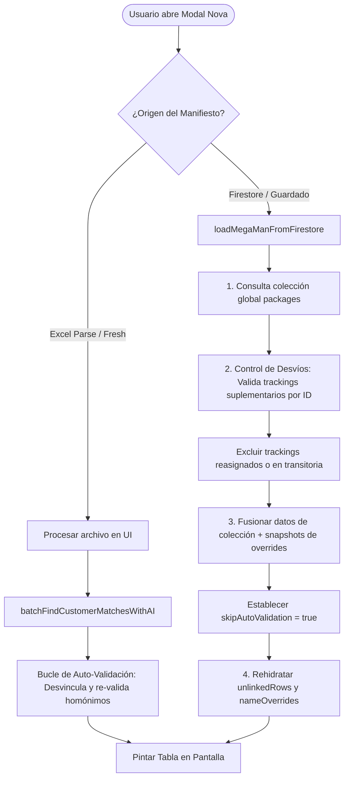
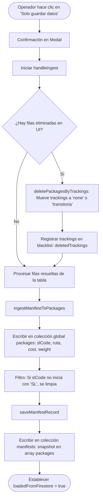
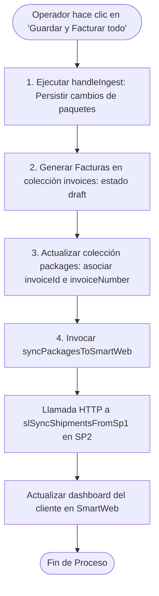
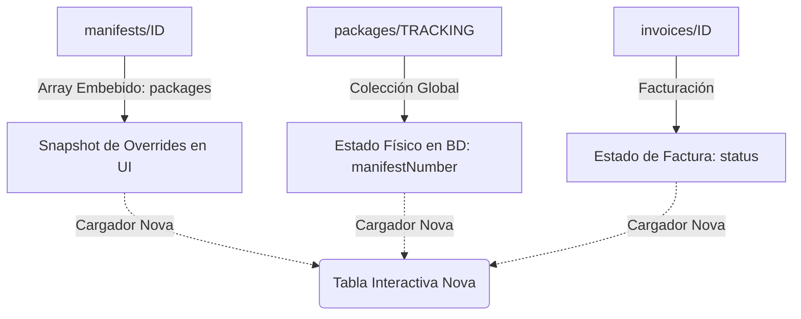
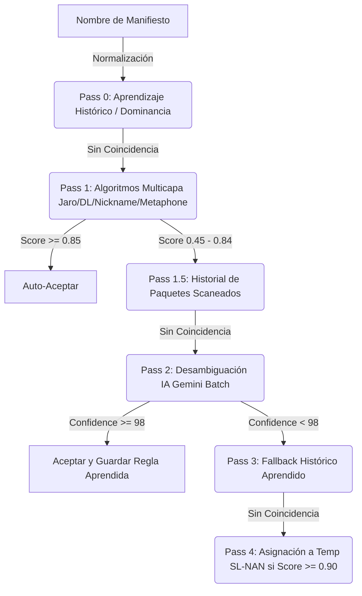
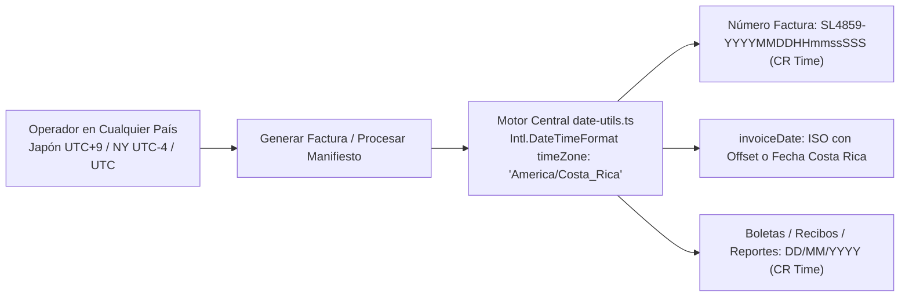

# Nova: Guía de Arquitectura, Escenarios y Ciclo de Vida de Manifiestos

Este documento detalla la arquitectura de sincronización, la arquitectura de flujos de procesos, el motor de coincidencia algorítmica y de IA, la taxonomía de colecciones, las transiciones de estado y todos los flujos lógicos (casos de uso) del gestor de manifiestos **Nova** en el portal de administración.

> **Documento Complementario Obligatorio:** Consulta [PRE_ALERTS_SSOT_AND_NOVA_RULES.md](./PRE_ALERTS_SSOT_AND_NOVA_RULES.md) para conocer las reglas de Única Fuente de Verdad (SSOT en SP2), discriminación matemática de carriers y compuertas de elegibilidad en manifiestos combinados.

---

## 1. Arquitectura del Flujo de Procesos de Nova

El ciclo de vida operativo de un manifiesto en la interfaz de Nova se divide en tres flujos principales de procesos. A continuación se detalla su flujo de control y las mutaciones en base de datos:

### A. Flujo de Carga e Inicialización (Load/Rehydration)
Determina cómo se monta el componente y se alimenta el estado local de la tabla:



### B. Flujo de Guardado Manual (Solo guardar datos)
Persiste los overrides locales del operador en Firestore de forma manual:



### C. Flujo de Facturación y Sincronización (Guardar y Facturar todo)
Procesa los cobros, genera facturas y notifica inmediatamente al portal del cliente (SP2):



---

## 2. Arquitectura de Sincronización y Datos

El motor de Nova interactúa con tres colecciones críticas en Firestore (base de datos `portal`):



### A. Colección `manifests`
*   **Arreglo Embebido `packages`**: Un snapshot en formato array de todas las filas en la tabla al momento del último guardado. Guarda los overrides locales del operador (asignaciones manuales, rutas forzadas, precios ajustados, etc.).
*   **Lista Negra `deletedTrackings`**: Array con los trackings que el administrador eliminó de la tabla Nova. Evita que paquetes eliminados vuelvan a ser cargados.

### B. Colección `packages`
*   **Campo `manifestNumber`**: Apunta al manifiesto activo al que pertenece el paquete (`"none"` si se libera, `"consolidacion_transitoria"` si la factura se anula).

### C. Colección `invoices`
*   **Relación**: Vincula múltiples trackings mediante el arreglo `trackingNumbers`. Su estado de facturación determina si la fila en Nova está protegida.

---

## 3. Motor de Coincidencia de Clientes (Customer Matcher Engine)

El proceso de vinculación de nombres de manifiestos (ej. `"VEGA CAMPOS MARIO"`) con clientes reales de la base de datos (`customers/{slCode}`) opera en un flujo híbrido compuesto por: normalización de texto, indexación en memoria, scoring algorítmico multicapa y evaluación por Inteligencia Artificial (Gemini).



### A. Capa de Normalización e Indexación (`matching/normalize.ts`)
Antes de ejecutar cualquier algoritmo, el nombre de búsqueda y los nombres de la base de datos se limpian sistemáticamente:
1.  **Limpieza de Ruido**: Se remueven acentos, caracteres especiales, y términos irrelevantes de Courier (ej. `"CARE OF"`, `"SJO"`, `"SMART LOGISTICS"`, `"MIA"`).
2.  **Tokens Significativos**: Se divide el string en tokens (palabras). Se omiten artículos y preposiciones de un solo carácter.
3.  **Indexación en Memoria**: Para evitar O(N) escaneos lineales sobre ~8,000 clientes, el cargador (`customer-loader.ts`) construye tres índices al arrancar la sesión:
    *   `byName`: Map de nombre normalizado exacto a cliente.
    *   `byNameReversed`: Map de nombre invertido (ej. `"López Carlos"` para `"Carlos López"`) a cliente.
    *   `byFirstToken`: Map indexado por la clave fonética (Soundex) del primer token del nombre, permitiendo búsquedas O(1) de candidatos preliminares (reduce de 8,000 a ~100 candidatos por nombre).

### B. Algoritmos de Similitud y Pesos (`matching/algorithms.ts` & `match-engine.ts`)
Para calificar la similitud entre el nombre de manifiesto (Búsqueda) y el cliente (Candidato), se aplican las siguientes técnicas secuenciales combinadas:

1.  **Jaro-Winkler Similarity**: Mide coincidencia de caracteres con tolerancia a transposiciones (typos de digitación) dando peso adicional a prefijos idénticos (ej. `"Alejandra"` vs `"Alexandra"`).
2.  **Damerau-Levenshtein Similarity**: Mide el número mínimo de operaciones (inserciones, eliminaciones, sustituciones y transposiciones de caracteres adyacentes) requeridos para transformar un string en otro.
3.  **Búsqueda Bidireccional de Apodos (Nicknames)**: Resuelve equivalencias de nombres de pila en español (ej. `"Pepe"` ↔ `"José"`, `"Paco"` ↔ `"Francisco"`, `"Nacho"` ↔ `"Ignacio"`), permitiendo que coincidan aunque las letras sean totalmente distintas.
4.  **Claves Fonéticas (Double Metaphone)**: Codifica palabras en base a su pronunciación en español/inglés, asegurando que variaciones fonéticas comunes (ej. `"García"` ↔ `"Garsia"`, `"Jiménez"` ↔ `"Gimenez"`) obtengan puntuación perfecta.
5.  **Puntuación de Tokens con Coeficiente de Peso (`tokenNameScore`)**:
    *   **Ancla de Primer Nombre**: El primer token (nombre de pila principal) tiene un **peso de 3×**, mientras que los subsecuentes (segundo nombre y apellidos) tienen peso **1×**.
    *   **Penalización por Excesos en Base de Datos**: Si el cliente en base de datos tiene nombres adicionales (ej. segundo nombre completo) que no vienen en el manifiesto de importación, se aplica una penalización muy baja de **0.3 por token excedente**, evitando descartar coincidencias legítimas.

---

### C. El Pipeline de 5 Pasos en Lote (`matching/batch-matcher.ts`)

Cuando se procesa una tabla, Nova ejecuta un pipeline de 5 pasos estructurado para maximizar velocidad y prevenir falsos positivos:

#### Pass 0: Coincidencias Aprendidas con Resolución de Homónimos (Dominancia Histórica)
1.  Busca en el historial de reasignaciones confirmadas por operadores (`match_feedback` en Firestore).
2.  **Evaluación de Dominancia**: Si el nombre coincide con una regla aprendida pero existe un competidor algorítmico fuerte en la base de datos de clientes (score >= 0.75):
    *   Consulta el conteo histórico de paquetes asociados a cada uno en Firestore.
    *   Si el competidor tiene un historial abrumador (conteo >= 5) y la regla aprendida proviene de IA automática (`ai_auto`) con conteo bajo (<= 1), el motor **sobrescribe** la regla automática a favor del ganador histórico por dominancia.
    *   Si los historiales son parejos, se cataloga como **colisión activa de homónimos**, abortando el auto-acoplamiento y forzando revisión manual en la UI (`requiresUserChoice = true`).

#### Pass 1: Coincidencia Algorítmica Directa
*   **Fast Path**: O(1) busca en índice exacto e índice invertido. Si hay hit de cliente real, asocia con score `1.0`.
*   **Umbral de Aceptación Automática (`AUTO_ACCEPT_MIN = 0.85`)**: Si un candidato obtiene score >= 0.85, cuenta con un mínimo de 2 tokens significativos, no tiene competidores en rango de proximidad y no es ambiguo, se **auto-asocia** directamente sin pasar por Inteligencia Artificial.
*   **Corte por Prefix de Ruta**: Si el nombre inicia con marcas de ruta (ej. `"HEREDIA SMART"`), se bloquea la auto-asociación a menos que exista una regla aprendida previa.

#### Pass 1.5: Historial Reciente de Paquetes
*   Para los nombres que no obtuvieron coincidencia fuerte algorítmica, Nova realiza una consulta masiva en la colección global `packages` buscando los nombres exactos en campos históricos (`nombre`, `customerName`, `nombreCliente`).
*   Si encuentra un paquete previo procesado con ese nombre de manifiesto, asume la asociación humana previa y asocia el `slCode` con score `0.99`, ahorrando llamadas a la API de Inteligencia Artificial.

#### Pass 2: Desambiguación IA Gemini en Lote
*   Los nombres remanentes con score medio (0.45 a 0.84) se envían a la API de Gemini en lotes de 12 para desambiguar entre los 5 mejores candidatos algorítmicos.
*   Los nombres sin ninguna coincidencia se envían a Gemini en lotes de 10 para una búsqueda semántica amplia contra los 50 clientes más probables.
*   **Criterio de Aceptación Ultra-Estricto**: Solo se aceptan respuestas de la IA que tengan una confianza **>= 98%** (`AI_ACCEPT_CONFIDENCE`). Si la confianza es inferior, la IA retorna `null` y la fila queda pendiente para el usuario.
*   **Auto-Aprendizaje**: Si la IA resuelve con confianza >= 98%, la regla se escribe automáticamente en la base de datos `match_feedback` (`source: 'ai_auto'`) para automatizar las importaciones futuras de ese mismo cliente.

#### Pass 3: Fallback Histórico Aprendido
*   Aplica coincidencias históricas con score menor que el óptimo de Pass 0, pero resolviendo colisiones.

#### Pass 4: Asignaciones Temporales (`SL-NAN`)
*   Como último recurso, si la fila no coincide con ningún cliente real ni aprendida, y tiene una coincidencia algorítmica extremadamente alta (score >= 0.90) con un cliente temporal (`SL-NAN-XXXX`), se asigna a este último. De lo contrario, queda marcado como "Sin Registro" (`unmatched`).

### D. Prevención de Conflictos y Barredora Activa (Conflict Sweeper & Unlink)
Para asegurar que los errores humanos corregidos no contaminen el motor de aprendizaje a futuro:
1.  **Barredora de Conflictos (Conflict Sweeper)**: Al guardar un manifiesto con una asignación correcta (ej. `"MARIA JOSE LEANDRO DIAZ"` ➜ `SL1562`), la función `saveMatchFeedbackBulk` consulta automáticamente todos los registros previos asociados a ese nombre normalizado y elimina de forma física cualquier entrada en `match_feedback` y `manifest_learning_patterns` que apunte a un código SL diferente (ej. `SL26116` Picón).
2.  **Olvido Activo al Desasociar (Unlink)**: Al desvincular una fila en la UI de Nova, la función `forgetMatchFeedback` borra de inmediato de Firestore los registros de aprendizaje de ese nombre en las colecciones `match_feedback`, `manifest_learning_patterns` y `unmatched_route_learning`.
3.  **Seguridad y Control de Roles**: Las operaciones de eliminación en Firestore están restringidas en `firestore.rules` a usuarios administradores (`ADMIN`/`SUPER_ADMIN`). Si un operador estándar realiza la acción, la denegación de borrado se captura de forma silenciosa para evitar bloqueos operativos.

---

## 4. Matriz de Transición de Campos en Base de Datos

La siguiente tabla describe exactamente qué campos cambian en Firestore en cada uno de los procesos y pantallas del sistema:

| Proceso / Pantalla | Colección | Campo | Valor Antes | Valor Después | Observación / Razón |
| :--- | :--- | :--- | :--- | :--- | :--- |
| **Ingesta Inicial (Excel)** | `packages` | `manifestNumber` | No existe | `ID_MANIFIESTO` | Crea físicamente el paquete en la base de datos vinculándolo al manifiesto. |
| | `packages` | `status` | No existe | `"customs"` | Estado inicial de aduana por defecto. |
| | `packages` | `slCode` | No existe | `"SLXXXX"` o `""` | Si hubo coincidencia AI o pre-alerta, guarda el código; si no, queda vacío. |
| | `manifests` | `packages` (array) | No existe | `[Snapshot Rows]` | Guarda el snapshot con la fila resuelta y los metadatos de render. |
| **Solo Guardar Datos (Nova)**| `packages` | `slCode` | Código anterior | Nuevo `"SLXXXX"` | Persiste cambios de clientes manuales. Si no inicia con `"SL"`, se limpia a `""`. |
| | `packages` | `ruta` | Ruta anterior | Nueva Ruta | Cambia la ruta asignada al paquete en base a la del cliente o selección. |
| | `manifests` | `packages` (array) | Snapshot anterior | Snapshot Nuevo | Actualiza el array en el manifiesto con los overrides de nombres, rutas y precios. |
| **Guardar y Facturar (Nova)** | `packages` | `invoiceNumber` | `""` | `"SLXXXX-YYYYMMDD..."` | Liga el paquete a la factura generada. |
| | `packages` | `status` | `"customs"` | `"invoiced"` | Promueve el estado a facturado. |
| | `invoices` | `status` | No existe | `"draft"` o `"sent"` | Crea la factura correspondiente en estado borrador o enviada. |
| **Eliminar Fila (Nova)** | `packages` | `manifestNumber` | `ID_MANIFIESTO` | `"consolidacion_transitoria"` (si está protegido) o `"none"` | Desvincula el paquete del manifiesto para que quede libre. |
| | `packages` | `encomiendaManifestNumber`| `ID_MANIFIESTO` | `"none"` (si es encomienda) | Remueve la asociación al manifiesto consolidado de encomiendas. |
| | `manifests` | `deletedTrackings` | `[]` | `[..., TRACKING]` | Registra el tracking en la lista negra para prevenir recargas accidentales. |
| **Anular Factura (/invoices)** | `invoices` | `status` | `"sent"` / `"overdue"` | `"annulled"` | Marca la factura como anulada en el módulo de facturación. |
| | `packages` | `manifestNumber` | `ID_MANIFIESTO` | `"consolidacion_transitoria"` | Pasa a estado de consolidación transitoria para ser relanzado a otro manifiesto. |
| | `packages` | `status` | `"invoiced"` | `"consolidated"` | Libera el paquete del estado bloqueado facturado. |
| **Trasladar Manifiesto (Nova)**| `packages` | `manifestNumber` | `MANIFIESTO_A` | `MANIFIESTO_B` | Cambia el identificador del manifiesto global. |
| | `packages` | `encomiendaManifestNumber`| `MANIFIESTO_A` | `MANIFIESTO_B` (si `B` es `"ENC-"`) | Actualiza la correspondencia en manifiestos consolidados. |
| **Carry-On (Consolidación)** | `packages` | `manifestNumber` | `CONSOLIDACION_TRANSITORIA` | `ID_MANIFIESTO` | Reasigna el paquete de transitoria al nuevo manifiesto Courier. |
| | `packages` | `encomiendaManifestNumber`| `MANIFIESTO_ANTERIOR` | `ID_MANIFIESTO` (si es `"ENC-"`) o `"none"` | Limpia el campo para evitar exclusión en la carga de Nova. |

---

## 5. Escenarios Detallados de Ciclo de Vida

### Escenario 1: Importación de Manifiesto (Fresh Parse)
*   **Origen**: Carga de un archivo Excel de Courier por primera vez en la UI.
*   **Estado**: `loadedFromFirestore = false`, `dataOriginPolicy.origin = "fresh"`.
*   **Bucle de Validación de Clientes**:
    1.  El motor ejecuta el pipeline de 5 pasos (Pass 0 al Pass 4) detallado en la Sección 3.
    2.  Si la confianza supera el umbral de aceptación automática (`0.85`), asigna automáticamente el código `slCode` y la ruta del cliente a la fila.
    3.  Busca pre-alertas activas por tracking. Si encuentra una pre-alerta no entregada, asocia el paquete al cliente que creó la pre-alerta.
    4.  Si no hay coincidencias de alta confianza, la fila queda marcada como `unmatched` (Sin Registro).
*   **Acciones del Operador**: Puede corregir nombres, reasignar rutas, o marcar filas como desvinculadas (`unlinked`).

### Escenario 2: Persistencia Inicial ("Solo guardar datos")
*   **Función**: `handleIngest` (Nova) llama a `ingestManifestToPackages` y `saveManifestRecord`.
*   **Proceso**:
    1.  **Bitácora de Eliminaciones**: Si el operador eliminó filas, los trackings se guardan en la lista negra (`deletedTrackings`) y se desasocian en lote (`deletePackagesByTrackings`).
    2.  **Carga Global**: Para cada fila en la tabla, se crea o actualiza un documento en la colección global `packages`, asignando su `manifestNumber` al ID del manifiesto actual y estampando su precio/peso.
    3.  **Filtro de Seguridad de Código SL**: Si el código resuelto de una fila no inicia con la abreviación `"SL"` (por ejemplo, marcadores de ruta como `"Heredia"` o `"Coronado"`), el campo `slCode` en el paquete se limpia (`""`) para evitar la facturación errónea.
    4.  **Guardado del Manifiesto**: Se escribe el documento `manifests/{manifestNumber}` con el arreglo `packages` conteniendo el snapshot actual del manifiesto.
*   **Resultado**: El manifiesto pasa a estado guardado (`loadedFromFirestore = true`).

---

## 6. Cargas y Desvíos de Datos (Integridad de Datos Guardados)

### Escenario 3: Carga de Manifiesto Guardado desde Firestore
*   **Origen**: El operador abre un manifiesto existente.
*   **Estado**: `loadedFromFirestore = true`, `dataOriginPolicy.origin = "firestore"`.
*   **Bucle de Carga Seguro (Fiel al Guardado)**:
    1.  Lee el documento `manifests/{manifestNumber}` para cargar la lista negra de eliminaciones y el array embebido.
    2.  Consulta la colección global `packages` para traer los documentos cuyo `manifestNumber` coincida con este manifiesto o sus orígenes.
    3.  **Resolución de Desvíos de Suplementos (Bucle de Corrección)**:
        *   Identifica paquetes que existen en el arreglo embebido del manifiesto, pero que no fueron retornados por la consulta de la colección global (porque su `manifestNumber` cambió).
        *   **Control de Reasignaciones (GAP Corregido)**: Para cada paquete candidato a suplemento, se consulta su documento real en Firestore. Si su `manifestNumber` actual es diferente al de este manifiesto (por ejemplo, porque fue movido a `"consolidacion_transitoria"` o a otro manifiesto de ruta), **se excluye de la carga**. Esto evita que paquetes trasladados reaparezcan en su manifiesto de origen.
    4.  **Fusión de Datos**: Combina los overrides del arreglo embebido (nombres manuales, exclusiones) con los datos transaccionales en vivo de la colección global (peso real, estado de la factura).
    5.  **Modo Solo Lectura Pasivo**: Se desactivan los auto-validadores (`skipAutoValidation = true`) y el auto-guardado en segundo plano, protegiendo las asignaciones manuales del operador contra sobreescrituras automáticas.

### Escenario 4: Eliminación y Logical Rollback de Filas
*   **Acción**: El operador borra una fila de la tabla y guarda el manifiesto.
*   **Proceso de Desasociación (`deletePackagesByTrackings`)**:
    1.  El tracking se registra en `deletedTrackingsSet` para evitar re-fisiones.
    2.  En la colección global `packages`, el documento se actualiza:
        *   Si el paquete tiene un estado de facturación protegido (ej. `consolidated`, `invoiced`), su `manifestNumber` cambia a `"consolidacion_transitoria"`.
        *   Si es un paquete ordinario sin facturación activa, su `manifestNumber` vuelve a `"none"`.
        *   El paquete no se borra físicamente para preservar su historial de escaneo, pero queda libre de este manifiesto.

### Escenario 5: Anulación de Facturas (Desde pantalla externa /invoices)
*   **Acción**: El administrador anula una factura que contiene trackings del manifiesto.
*   **Proceso**:
    1.  La factura se marca como `annulled`.
    2.  Para cada tracking, el backend actualiza su documento en la colección global `packages`:
        *   `manifestNumber = "consolidacion_transitoria"`.
        *   `status = "consolidated"`.
    3.  **Seguridad en Carga de Nova**: El documento del manifiesto en la colección `manifests` no se altera. Sin embargo, al recargar el manifiesto en Nova, el filtro de control de reasignaciones (Escenario 3) detecta que el tracking ahora pertenece a `"consolidacion_transitoria"` en la colección global, y lo remueve del listado del manifiesto de forma proactiva. **El paquete no vuelve a aparecer.**

### Escenario 6: Traslado Manual de Manifiesto
*   **Acción**: El operador selecciona un grupo de filas y utiliza la acción "Cambiar manifiesto" para moverlos a otro manifiesto (ej. de `A` a `B`).
*   **Proceso**:
    1.  En la colección `packages`, los trackings se actualizan con `manifestNumber = B`.
    2.  Al abrir el manifiesto `A`, el control de reasignaciones asíncrono detecta que los paquetes están ahora asignados a `B` y los excluye de `A`.
    3.  Al abrir el manifiesto `B`, la consulta de base de datos extrae los paquetes por su nuevo `manifestNumber` y los muestra listos para facturar en su nuevo destino.

---

## 7. Matriz de Estados de la Fila Nova

| Estado en UI | slCode | Ruta | Factura en BD | Comportamiento en Reabrir / Carga |
| :--- | :--- | :--- | :--- | :--- |
| **Vinculado** | `SLXXXX` | Ruta Válida | Draft / Sent | Carga pasiva del cliente asignado. Protegido si la factura está enviada. |
| **Sin Registro** | `""` | Ruta Válida | No tiene | Se agrupa por el nombre del manifiesto. Queda pendiente de asignar. |
| **Excluido** | `""` | `""` | No tiene | Marcado como `unlinked`. Se agrupa de forma independiente en la tabla. |
| **Trasladado** | `SLXXXX` | Ruta Válida | No tiene (en este) | El `manifestNumber` global cambió. Excluido del cargador original por validación de desvío. |

---

## 8. Sincronización y Dependencias con Otros Componentes

El módulo Nova actúa como el núcleo operativo de paquetes del portal administrador (SP1), y se conecta directamente con los siguientes componentes del sistema para asegurar la integridad de datos transaccionales:

### A. Módulo de Pre-Alertas (Asociación e Integridad)
*   **Asociación en Ingesta**: Durante la ingesta inicial de un manifiesto Excel (Fresh Parse), Nova consulta la colección `pre_alerts`. Si existe una pre-alerta activa (`pre-alerted` o `received`) para el tracking del paquete, Nova lo vincula de inmediato al `slCode` del creador de la pre-alerta.
*   **Advertencia de Desvío**: Si el operador de Nova intenta reasignar manualmente un paquete pre-alertado a un cliente distinto, Nova muestra una advertencia de seguridad para evitar "secuestro" de paquetes.
*   **Reasignaciones de Cuentas (`slReassignPreAlert`)**: Si un administrador mueve pre-alertas de una cuenta a otra (ej. depuración de duplicados), la función Cloud reasigna los documentos de pre-alerta y empuja el cambio a SP2 con la bandera `isPreAlertReassign: true` para sortear las colisiones de propietario.

### B. Sincronización de Portales (SP1 Admin ↔ SP2 Cliente)
*   **Servicio de Sincronización (`sync-smartweb-service`)**: Cada vez que Nova realiza un guardado que afecta el estado operativo o facturación de los paquetes, invoca `syncPackagesToSmartWeb`. Este servicio envía en lotes los datos actualizados al endpoint HTTPS `slSyncShipmentsFromSp1` en el proyecto del cliente (SP2).
*   **Guardia contra Colisión de Propietarios (SP2)**: Para prevenir que errores manuales de digitación en SP1 alteren embarques ya asociados a clientes reales en SmartWeb, SP2 rechaza la sincronización si el código SL no coincide con el guardado en SP2, a menos que el administrador envíe la bandera `forceSync: true` (forzado manual) o `isPreAlertReassign: true` (reasignación de pre-alertas).
*   **Lazo de Anti-Bucle (Anti-Loop)**: Para evitar actualizaciones circulares infinitas entre bases de datos, los paquetes modificados por sincronización en SP2 registran `syncedFromSp1: true`. Los triggers de SP2 (`onPackageCreated`/`onPackageUpdated`) leen esta bandera e interrumpen la propagación de retorno hacia SP1 de inmediato.

### C. Módulo de Facturación y Anulaciones (Logical Rollbacks)
*   **Anulación de Facturas (`invoice-service`)**: Al anular una factura desde el panel de control de facturas, el sistema ejecuta `annulInvoicesByTrackingsAndManifest`.
    *   Este proceso actualiza la colección `packages` en SP1, moviendo los trackings de la factura al contenedor `"consolidacion_transitoria"` y degradando su estado a `"consolidated"`.
    *   Inmediatamente gatilla un `syncPackagesToSmartWeb` para actualizar a los clientes en SP2 de la liberación de sus paquetes.
    *   El manifiesto físico (`manifests/{id}`) no se altera. En su lugar, el validador de desvíos asíncrono en Nova se encarga de interceptar y excluir de forma proactiva estos trackings en la siguiente carga de la tabla.

### D. Sincronización de Sesión de Rutas de Choferes (Driver Route Sessions)
*   **Consolidación en Ruta o Check-In (`route-session-service`)**: Cuando un chofer marca un paquete como consolidación durante la ruta activa, o cuando se justifica como consolidación al cerrar la sesión de ruta:
    *   Se actualiza la colección global `packages`: se establece `consolidacion = true`, `manifestNumber = "consolidacion_transitoria"`, `manifestId = "consolidacion_transitoria"`, y se desvinculan los campos de facturas (`invoiceId`, `invoiceNumber`, `invoiceStatus` eliminados).
    *   Se escribe un registro espejo en la colección `manifest_consolidation` con sus metadatos de peso, precio y manifiesto original para mantener la coherencia con el módulo de Invoices y vistas consolidadas.
    *   Se anula de forma automática cualquier factura activa vinculada a ese tracking en el manifiesto de origen.
*   **Devoluciones en Ruta o Check-In**: Cuando un paquete es marcado como devuelto (`returned`):
    *   Se establece `status = "returned"` en la colección global `packages`.
    *   La factura asociada y el `manifestNumber` original permanecen intactos.
    *   El paquete aparece de forma inmediata en el módulo de Devoluciones (`ReturnedPackages.tsx`) por medio de su consulta activa.
*   **Protección en Nova**: El cargador de manifiestos de Nova (`loadMegaManFromFirestore`) inyecta el `status` del paquete a nivel raíz del objeto de fila (`ManifestRow.status`). Esto permite que Nova bloquee la eliminación accidental de paquetes ya entregados, devueltos o consolidados por medio de su regla `isProtected`.

---

## 9. Detalles de Implementación del Código (Code-Level Details)

Para comprender con exactitud el comportamiento del sistema, a continuación se detallan los fragmentos clave de código y las prioridades de asignación de variables implementadas en el portal:

### A. Prioridad de Coalescencia Nula (??) en Carga
Al rehidratar un manifiesto guardado, la función `loadMegaManFromFirestore` (en [fusion.ts](file:///Users/jbricenoz/Workspace/smartlogistics/smart-portal-1/client/lib/services/manifest-processor/fusion.ts#L189-L193)) mapea los campos de cada fila aplicando la siguiente prioridad:

```typescript
customerName: ed?.customerName ?? p.customerName ?? inv?.customerName ?? '',
slCode:       ed?.slCode       ?? p.slCode       ?? inv?.slCode       ?? '',
ruta:         ed?.ruta         ?? p.ruta         ?? inv?.ruta         ?? '',
```

*   **Prioridad 1 (`ed` - Embedded Snapshot)**: Snapshot del manifiesto guardado. Garantiza que si el operador asoció manualmente a un cliente, esa decisión se preserve en Nova, incluso si la colección global de paquetes se actualizó externamente (ej. por escaneos de bodega).
*   **Prioridad 2 (`p` - Packages Collection)**: Documento físico del paquete global. Sirve como fuente primaria si el paquete es nuevo o no tenía overrides en el snapshot.
*   **Prioridad 3 (`inv` - Invoices)**: Metadata de facturación activa. Actúa como mecanismo de auto-curación si el snapshot y el paquete carecen de asociación pero existe un cobro asociado.
*   **Uso de Operador `??` (Nullish Coalescing)**: Se utiliza `??` en lugar de `||` para asegurar que el string vacío `""` (que representa un paquete desvinculado de forma explícita por el operador) sea considerado un valor válido y no se sobrescriba con datos de la colección o facturas.

### B. Resolución Flexible de Alias de Manifiestos
La función `loadManifestFromFirestore` (en [fusion.ts](file:///Users/jbricenoz/Workspace/smartlogistics/smart-portal-1/client/lib/services/manifest-processor/fusion.ts#L702-L743)) implementa una tolerancia a formatos de ID para evitar errores del usuario:
1.  **Año Auto-Completado**: Si el ID ingresado termina con formato de fecha simple `DD-MM`, intenta concatenar el año corriente (`-YYYY`) y consultar de nuevo en Firestore.
2.  **Búsqueda Insensitiva / Substrings**: Si no hay hit exacto, descarga la lista de manifiestos y realiza una comparación cruzada:
    *   Compara si el ID es substring del nombre en base de datos.
    *   Compara si el nombre en base de datos es substring del ID ingresado.
    *   Ignora diferencias de mayúsculas/minúsculas y espacios.

### C. Procesamiento por Lotes y Transacciones de Ingesta
En la función `ingestManifestToPackages` (en [ingestion.ts](file:///Users/jbricenoz/Workspace/smartlogistics/smart-portal-1/client/lib/services/manifest-processor/ingestion.ts#L735)):
*   **Límites de Firestore**: Se divide la tabla de paquetes en sub-lotes (chunks) de **450 registros** para mantenerse por debajo del límite estricto de 500 operaciones por lote de escritura (`writeBatch`) de Firestore.
*   **Paralelismo Seguro**: Cada lote se ejecuta de forma asíncrona concurrente mediante `Promise.all` incrementando el rendimiento de ingesta de manifiestos masivos de más de 1,000 filas.

### D. Control de Desvíos de Suplementos (Courier vs Encomiendas)
Para evitar que paquetes reasignados o liberados reaparezcan, la carga de suplementos embebidos en [fusion.ts](file:///Users/jbricenoz/Workspace/smartlogistics/smart-portal-1/client/lib/services/manifest-processor/fusion.ts) implementa una validación asincrónica dividida según el tipo de manifiesto:
1.  **Manifiestos Courier y Fusiones (Mega-Man)**: Compara el campo `manifestNumber` actual del paquete en la base de datos contra el conjunto `targetMnSet` (compuesto por el ID activo y todos sus orígenes de fusión `searchTerms`). Si no hay coincidencia, el paquete se excluye del cargador.
2.  **Manifiestos de Encomiendas (ID iniciando con `ENC-`)**: Debido a que los paquetes de encomiendas consolidados conservan su `manifestNumber` original para la trazabilidad Courier, la validación se realiza contra el campo `encomiendaManifestNumber`. El paquete solo se carga si su `encomiendaManifestNumber` actual coincide con el ID del manifiesto consolidado activo.
3.  **Cortocircuito de Transitoria**: Si el paquete en la base de datos global tiene su campo `manifestNumber` establecido en `'CONSOLIDACION_TRANSITORIA'` (independientemente del prefijo o tipo de manifiesto), el cargador lo excluye inmediatamente, impidiendo la reaparición de paquetes liberados, devueltos o anulados.

### E. Propagación de Reasignación de Clientes y Devoluciones
1.  **Propagación en Reasignación de Invoices**: Al actualizar el `clientSlCode` (propietario) de una factura (incluyendo borradores), el trigger de Firestore `onInvoiceWritten` (en [triggers.ts](file:///Users/jbricenoz/Workspace/smartlogistics/smart-portal-1/functions/src/invoices/triggers.ts#L623-L689)) intercepta el cambio y propaga de forma inmediata el nuevo `slCode`, `customerId` y `customerName` a todos los paquetes asociados en la colección global `packages`. Esto evita que las dependencias queden desfasadas o desvinculadas por diferencias de propietario.
2.  **Limpieza de Encomiendas en Devoluciones, Reasignaciones y Carry-On**:
    *   Al registrar un paquete como devuelto en [ReturnedPackages.tsx](file:///Users/jbricenoz/Workspace/smartlogistics/smart-portal-1/client/pages/consolidation/ReturnedPackages.tsx#L368), se limpia de forma determinista el campo `encomiendaManifestNumber` a `'none'` y se reubica el paquete en `'consolidacion_transitoria'`.
    *   Al reasignar un paquete devuelto o realizar un **Carry-On** (en `carryOnPackages`), se evalúa el tipo de manifiesto de destino: si es de encomiendas (inicia con `ENC-`), se establece `encomiendaManifestNumber` con el nuevo ID; de lo contrario, se limpia a `'none'` (o se remueve) para evitar la exclusión por resguardo al abrir manifiestos regulares, manteniendo la consistencia e integridad relacional de datos.

---

## 10. Especificación de Manifiesto de Encomiendas y Generación de Etiquetas

La pantalla de Manifiestos de Encomiendas ([EncomiendaManifests.tsx](file:///Users/jbricenoz/Workspace/smartlogistics/smart-portal-1/client/pages/encomiendas/EncomiendaManifests.tsx)) administra la visualización agrupada de clientes y la impresión masiva de etiquetas térmicas de encomienda. Sus reglas de negocio y dependencias son:

### A. Consulta y Filtro de Paquetes (`getPackagesForEncomiendas`)
La función query en [ingestion.ts](file:///Users/jbricenoz/Workspace/smartlogistics/smart-portal-1/client/lib/services/manifest-processor/ingestion.ts#L1222) extrae únicamente los paquetes que cumplen:
*   `ruta === 'Encomiendas'`.
*   El estado (`status`) **no** debe pertenecer a un listado de estados finales o en tránsito: `['delivered', 'processed', 'on_route', 'route', 'in_route', 'on_rute', 'on-route', 'in-route', 'returned', 'pickup']`.
*   Cada paquete debe contar con un `manifestNumber` asignado.

### B. Generación de Etiquetas y Resolución de Direcciones (SmartWeb vs Portal Admin)
Al abrir el previsualizador masivo ([EncomiendaBulkLabelModal.tsx](file:///Users/jbricenoz/Workspace/smartlogistics/smart-portal-1/client/components/nova/EncomiendaBulkLabelModal.tsx)) o el modal individual ([NovaShippingLabelModal.tsx](file:///Users/jbricenoz/Workspace/smartlogistics/smart-portal-1/client/components/nova/NovaShippingLabelModal.tsx)), se ejecuta una consulta a `customers/{slCode}` para extraer el perfil y resolver la dirección física de destino.

#### 1. Resolución Centralizada del Transportista (resolveCustomerEncomiendaService)
Para evitar discrepancias visuales entre la tabla de Nova (que renderiza badges de encomiendas) y las etiquetas físicas impresas, la lógica de resolución se unifica bajo la función pura [`resolveCustomerEncomiendaService`](file:///Users/jbricenoz/Workspace/smartlogistics/smart-portal-1/client/lib/services/encomienda-lookup.ts#L107-L147) en `encomienda-lookup.ts`. Esta función evalúa los datos del cliente aplicando el siguiente orden estricto de precedencia:

1.  **Dirección por Defecto del Cliente (SmartWeb)**: Inspecciona `defaultAddress.encomienda` (nombre, ID, o string).
2.  **Direcciones Secundarias**: Revisa recursivamente la lista `addresses` buscando la primera dirección activa que tenga asignado un transportista.
3.  **Propiedades Raíz (Sincronización SP1 & SP2)**:
    *   `encomiendaServiceName`: Nombre comercial sincronizado desde SP2 (por ejemplo, *"Transportes Guanacaste"*). Es la fuente de verdad principal a nivel de perfil.
    *   `encomiendaProvider`: Nombre de respaldo de SP1.
    *   `encomienda` (Objeto): Valida que contenga claves válidas (`name`, `id`, `nombre`). **Seguridad contra Objetos Vacíos**: Si el campo en Firestore contiene un objeto vacío `{}`, la función lo descarta de manera proactiva, impidiendo que cortocircuite la lógica de JavaScript y bloquee la evaluación de los campos raíz posteriores.
    *   `encomiendaName` / `encomiendaId`: Campos legacy de compatibilidad.
4.  **Respaldo/Hint del Manifiesto**: Si todas las búsquedas del perfil fallan (o la consulta a la base de datos devuelve error), la función cae al parámetro de respaldo `hint` provisto por la vista emisora (`encomiendaName` en la cola de impresión).

Cualquier valor obtenido (ID alfanumérico o nombre comercial directo) se procesa por medio de `resolveEncomiendaName` para traducirlo a su nombre de fantasía comercial real utilizando la caché de lookup.

#### 2. Dirección de Entrega y Prioridades de Anulación
*   **Prioridad de Anulación (adminAddressOverride)**: Si el cliente posee una dirección y courier corregidos previamente por la administración (`adminAddressOverride`), se cargará ésta de manera predeterminada para evitar re-escrituras.
*   **Dirección Base del Cliente (SmartWeb)**: Si no hay anulación de administración, se utiliza de manera estricta la dirección principal/default del cliente en SmartWeb (`c.defaultAddress` o cualquier dirección del arreglo `addresses` con `isDefault === true` y activa), cayendo en `addresses[0]` solo si no hay default.
*   **Dirección Completa**: Se construye combinando las propiedades físicas de la dirección base (`streetAddress` + `details` + `deliveryInstructions`) unidas con saltos de línea para asegurar que no se omitan instrucciones o detalles.
*   **Preservación de Datos e Interfaz Interactiva**:
    *   **Píldoras Selectoras**: Si existen ambas opciones, el modal individual presenta un conmutador con dos botones en la UI para alternar libremente entre la dirección original del cliente en `Cliente (SmartWeb)` y la dirección corregida por administración en `Admin (Portal)`.
    *   **Casilla de Persistencia**: Se incluye el checkbox `Guardar cambios como dirección de administración preferida (no altera el perfil del cliente en SmartWeb)`. Si está marcado:
        1. La dirección editada se guarda de manera aislada en `adminAddressOverride` en Firestore (evitando aplanar el perfil estructurado del cliente).
        2. El servicio de encomienda seleccionado se propaga y persiste automáticamente en el perfil principal del cliente en **SP1** (`customers`) y **SP2** (`users`) mediante `updateCustomerEncomiendaService`, de modo que no sea necesario volver a seleccionarlo en futuras impresiones.
        Si la casilla está desmarcada, los cambios son meramente locales para la impresión térmica actual.
*   **Deduplicación de Puntos de Referencia e Instrucciones**: Antes de enviar los datos al formateador de etiquetas o generar despachos de encomiendas, se ejecuta un algoritmo de deduplicación de alta precisión. Este analiza las líneas de `streetAddress`, `details` y `deliveryInstructions` para detectar segmentos redundantes (como repeticiones exactas o descripciones duplicadas de señas de color, portón o referencias locales) mediante tokenización de palabras significativas. Esto limpia el contenido y optimiza el uso del espacio físico en las etiquetas térmicas.

### C. Control y Diagnóstico de Clientes "Sin Datos"
Si un cliente no ha completado su registro de dirección, o tiene únicamente direcciones vacías e inactivas (`streetAddress: ""`, `isActive: false`), la función `resolveAddress` retorna valores vacíos para la dirección de entrega y el transportista.
*   **Comportamiento de Impresión**: El sistema no bloquea la generación del código de barra o etiqueta; se genera la etiqueta en blanco con campos vacíos de dirección y servicio para que puedan ser completados a mano.
*   **Garantías Visuales en UI**: Para evitar impresiones en blanco accidentales:
    *   **Toolbar**: Se muestra un badge de alta visibilidad intermitente (`animate-pulse`) indicando el número exacto de clientes "sin datos".
    *   **Doble Botón de Impresión**: Si hay etiquetas incompletas, se presentan dos botones diferenciados:
        *   `Imprimir completas (N)`: Emite únicamente las etiquetas que poseen configuraciones de dirección de encomienda válidas y completas.
        *   `Imprimir todas (M)`: Emite la cola completa de etiquetas, incluyendo aquellas con perfiles incompletos que saldrán en blanco.
    *   **Banner de Advertencia**: Se renderiza una alerta destacada al inicio de la lista detallando los nombres y códigos de cliente específicos que saldrán en blanco.
    *   **Clase `no-print`**: Tanto el banner de advertencia como las etiquetas incompletas marcadas con badge de alerta ámbar están estilizados con la regla `@media print { .no-print { display: none; } }` para evitar que contaminen la cola física de etiquetas térmicas.

### D. Manejo de Fallbacks para Clientes No Registrados / Errores de Búsqueda
Si el cliente no se encuentra en la base de datos (por ejemplo, porque es un código de cliente nuevo/inexistente o la consulta a la API de Firestore falla/lanza una excepción):
*   **Construcción de Vista Previa de Respaldo (Fallback)**: El modal `EncomiendaBulkLabelModal.tsx` intercepta el error en su bloque `catch` y construye un objeto `ParcelPreview` seguro y alternativo a partir de los datos básicos presentes en el manifiesto (conservando `slCode`, `clientName` como recipientName, `trackings` y `ruta`). Los campos del perfil como dirección (`deliveryAddress`), teléfono y DNI se definen en blanco.
*   **Flag de Datos Faltantes**: Se le asigna `hasMissingData: true` y se registra la descripción del error.
*   **Impresión e Integridad del Lote**: Al no ser nulo el objeto `preview`, el cliente no registrado entra en la cola de renderizado y se genera una etiqueta para él. Esto garantiza que al hacer clic en **"Imprimir todas"**, no se omitan hojas en la impresión física, permitiendo al operador completar los datos a mano en la bodega si es necesario. Si se hace clic en **"Imprimir completas"**, el filtro `!hasMissingData` lo excluye de manera segura.

---

## 11. Flujo de Devoluciones, Reasignación a Manifiestos y Boletas de Ruta

### A. Diferenciación Estricta: Devolución vs Anulación de Facturas
1. **Acción "Devolver Paquetes" (en Invoices.tsx o Sesiones de Choferes)**:
   * **Invariante Crítico**: **La factura NO se anula ni se cancela**. Conserva su estado original (`status: 'paid'`, `'sent'`, `'draft'`) y se mantiene como comprobante válido de cobro.
   * **Mutación en Paquetes**: En la colección `packages`, se actualizan los campos:
     * `status: 'returned'`
     * `deliveryStatus: 'returned'`
     * `returnedAt: string (ISO)`
     * `returnReason: string`
   * **Auditoría**: Se agrega una entrada en `statusHistory` de la factura indicando que sus paquetes fueron devueltos por administración/ruta.

2. **Detección Reactiva en Bandeja de Devoluciones ([ReturnedPackages.tsx](file:///Users/jbricenoz/Workspace/smartlogistics/smart-portal-1/client/pages/consolidation/ReturnedPackages.tsx))**:
   * Mediante una suscripción en tiempo real (`onSnapshot` sobre `packages where status == 'returned'`), cualquier paquete marcado como devuelto por un chofer o por el admin aparece **inmediatamente** en la vista de Devoluciones con su `trackingNumber`, cliente, ruta, motivo y su `invoiceNumber` activo intacto.

### B. Reasignación de Paquete Devuelto a un Manifiesto Destino
Al reasignar el paquete desde la vista de devoluciones a un manifiesto procesado (`targetManifest`):
1. **Actualización de Manifiesto en `packages`**:
   * `manifestNumber: targetManifest`
   * `manifestId: targetManifest`
   * `encomiendaManifestNumber: 'none'` (o el ID de encomienda correspondiente si el destino inicia con `ENC-`).
   * `status: 'customs'` / `'processed'`.
2. **Conservación de Factura**: El paquete retiene su `invoiceId` e `invoiceNumber` (o se actualiza si el admin lo determina), quedando habilitado para el nuevo despacho.

### C. Agrupación y Suma de Facturas en Boletas de Ruta ([nova-print.ts](file:///Users/jbricenoz/Workspace/smartlogistics/smart-portal-1/client/lib/utils/nova-print.ts#L205-L285))
Al imprimir el manifiesto de ruta para el chofer ([RoutesManagement.tsx](file:///Users/jbricenoz/Workspace/smartlogistics/smart-portal-1/client/pages/routes/RoutesManagement.tsx) ➜ `buildRouteManifestHTML`):
1. **Agrupación Unificada por Cliente**: Todos los paquetes del mismo cliente (mismo `slCode` o nombre) se consolidan bajo un solo bloque de entrega para el chofer.
2. **Detección Multi-Factura (`activeInvoiceMap`)**:
   * Si el cliente posee paquetes de su factura original y paquetes de la factura reasignada, el generador detecta todas las facturas activas.
   * Renderiza el badge: `Factura #FAC-001, #FAC-002`.
   * **Suma automáticamente los montos de ambas facturas**:
     $$\text{Total a Cobrar} = \sum \text{Facturas Activas (USD / CRC)} + \sum \text{Paquetes sin facturar}$$
3. **Desglose de Trackings**: Lista cada número de rastreo debajo del cliente, especificando entre paréntesis a cuál factura pertenece (`Tracking 9400... (FAC-001)`).

---

## 12. Rendimiento y Reactividad en Facturación y Nova

### A. Previsualización Instantánea de Facturas ([Invoices.tsx](file:///Users/jbricenoz/Workspace/smartlogistics/smart-portal-1/client/pages/invoices/Invoices.tsx))
* **Patrón de Resolución por Capas (Layered Resolution)**:
  * **Capa 1 (Memoria RAM, 0ms)**: Lee los datos de la factura directamente de la lista ya cargada en la tabla.
  * **Capa 2 (Firestore SDK, <50ms)**: Si faltan ítems, ejecuta `getDoc` puntual en lugar de invocar la Cloud Function pesada `slGetInvoice` (reduciendo la latencia de 48.2s a <50ms con $0$ lecturas redundantes).
  * **Resolución de Perfiles**: Obtiene correo, DNI, teléfono y ruta desde la suscripción activa `customerInfoBySlCode` en RAM.

### B. Anulación Ultra-Rápida de Facturas (`handleAnnulInvoice`)
* **Escritura Directa Atómica**: Usa `firestoreApi.invoices.update` con `status: 'annulled'` y `writeBatch` para desvincular paquetes a `consolidacion_transitoria`.
* **Sincronización SP2 en Background**: Desencadena `deleteInvoiceFromSp2` en segundo plano sin bloquear la interfaz (<100ms de respuesta).

### C. Reactividad en Tiempo Real de NovaTableModal (`subscribePackagesByManifest`)
* Resuelve de forma asíncrona todos los sub-manifiestos de fusiones `MEGA-MAN` (`fusedManifests` / `fusedFrom`) y escucha en paralelo la colección `packages` y `manifest_consolidation`.
* Emite trackings en vivo a `useNovaPackagesWatch`, permitiendo que la tabla de Nova actualice los contadores de cabecera y pie de página en vivo ante traslados de Carry-On conservando intactos todos los overrides y ediciones locales del operador.

---

## 13. Motor Universal de Zona Horaria Costa Rica (`America/Costa_Rica` - UTC-6) e Invarianza Geográfica

### A. Contexto y Requisito de Invarianza Geográfica
* **Problema de Negocio**: SmartLogistics opera legal, financiera y operativamente en Costa Rica. Si un administrador o chofer viaja y opera el sistema desde otra zona horaria (por ejemplo, Tokio `Asia/Tokyo` UTC+9, Londres `Europe/London` UTC+1, Nueva York `America/New_York` UTC-4 o Honolulu `Pacific/Honolulu` UTC-10), las funciones nativas del navegador (`new Date().getHours()`, `new Date().toISOString().slice(0, 10)`, `new Date().toLocaleDateString()`) producen discrepancias de fecha (día adelantado o atrasado al cruzar la medianoche UTC).
* **Solución y Garantía**: Toda la lógica de generación de identificadores de factura, marcas temporales de emisión, fechas de vencimiento, cálculos de estado de cuenta y visualización de fechas en tablas e impresiones está estrictamente normalizada sobre la zona horaria **`America/Costa_Rica` (UTC-6)** de forma determinista y universal.



### B. Módulo Central de Utilidades ([date-utils.ts](file:///Users/jbricenoz/Workspace/smartlogistics/smart-portal-1/client/lib/utils/date-utils.ts))
* **`COSTA_RICA_TIMEZONE = 'America/Costa_Rica'`**: Constante canónica de zona horaria.
* **`getCostaRicaDateParts(dateVal)`**: Extrae `{ year, month, day, hours, minutes, seconds, milliseconds, yearStr, monthStr, dayStr, hourStr, minuteStr, secondStr, millisecondStr, isoDate }` usando `Intl.DateTimeFormat` configurado con `timeZone: 'America/Costa_Rica'`.
* **`generateInvoiceNumber(slCode, isConsolidation, refDate)`**: Construye el número de factura determinista:
  $$\text{InvoiceNumber} = \begin{cases} \text{SLCode}-\text{YYYYMMDDHHmmssSSS} & \text{si es individual} \\ \text{SLCode}-\text{YYYYMMDDHHmmssSSS}-\text{C} & \text{si es consolidada} \end{cases}$$
  donde cada componente numérico proviene exclusivamente de la hora local de Costa Rica.
* **`formatCostaRicaDate(dateVal, options)`**: Formatea fechas en formato `DD/MM/YYYY` en Costa Rica, preservando cadenas ya pre-formateadas.
* **`formatCostaRicaDateTime(dateVal, options)`**: Formateador de fecha y hora local con opciones configurables (12h o 24h).
* **`extractDateFromInvoiceNumber(invoiceNumber)`**: Extrae la fecha incrustada en el código de factura utilizando offset explícito `-06:00`, garantizando que no ocurra salto de día al visualizar estados de cuenta desde otras zonas horarias.
* **`getCostaRicaTodayISO()`**: Retorna la fecha actual en Costa Rica con formato `YYYY-MM-DD`.
* **`parseDateSafe(dateVal)`**: Parser polimórfico tolerante que maneja objetos `Date`, Firestore `Timestamp` (`{ seconds, nanoseconds }` y `.toDate()`), timestamps numéricos `number` y cadenas `string`.

### C. Cobertura de Pruebas y Certificación de Cero Regresiones
* **Suites de Pruebas Automatizadas**:
  * [`client/lib/utils/__tests__/timezone-exhaustive.spec.ts`](file:///Users/jbricenoz/Workspace/smartlogistics/smart-portal-1/client/lib/utils/__tests__/timezone-exhaustive.spec.ts): 17 pruebas exhaustivas ejecutadas bajo simulación de 6 zonas horarias globales (`Asia/Tokyo`, `Europe/London`, `America/New_York`, `Australia/Sydney`, `Pacific/Honolulu`, `UTC`).
  * [`client/lib/utils/__tests__/date-utils.spec.ts`](file:///Users/jbricenoz/Workspace/smartlogistics/smart-portal-1/client/lib/utils/__tests__/date-utils.spec.ts): 17 pruebas unitarias de parseo, generación e invariancia.
* **Compatibilidad Retrospectiva con Datos Históricos**:
  * Cadenas legadas (`15/04/2026`, `28-02-2026`, `2026-05-14`).
  * Números de factura históricos (`SL4859-20260416154146-C`, `INV-20260101000000`).
  * Timestamps de Firestore en documentos existentes.
  * Manejo seguro de nulos, valores indefinidos y datos corruptos sin excepciones en tiempo de ejecución.

---

## 13. Arquitectura del Bloqueo Permanente de Precios Cero (Zero-Price Lock)

### A. Causa Raíz de la Regresión (Post-Mortem Técnico)
En JavaScript, el operador de coalescencia nula (`??`) evalúa el número `0` como un valor existente (ya que `0 !== null && 0 !== undefined`). En una refactorización previa realizada por la IA, se introdujo la expresión `(loadedFromFirestore ? row.precio : undefined) ?? fallback`. 

Cuando un paquete cargado de Firestore contenía un valor `precio: 0` (habitual en paquetes ingestados desde hojas externas de encomiendas o paquetería sin cotizar), la expresión devolvía `0`. El operador `??` detenía la cadena de evaluación en `0`, **bloqueando el cálculo de tarifas normales ($8, $12, $20, etc.)** y provocando que paquetes con peso cobrable se mostraran, guardaran y facturaran en `$0.00`.

### B. Arquitectura de Blindaje en 5 Capas
Para erradicar permanentemente esta vulnerabilidad, se implementó un bloqueo multi-capa:

1. **Capa 1 — Hook de Cálculos ([`use-nova-price-calcs.ts`](file:///Users/jbricenoz/Workspace/smartlogistics/smart-portal-1/client/hooks/use-nova-price-calcs.ts))**: `getEffectivePrice` descarta cualquier `precio <= 0` almacenado y calcula determinísticamente vía `calculatePrice`.
2. **Capa 2 — Hook de Filas Resueltas ([`use-nova-resolved-rows.ts`](file:///Users/jbricenoz/Workspace/smartlogistics/smart-portal-1/client/hooks/use-nova-resolved-rows.ts))**: Valida que si `row.peso > 0`, `effPrice` sea estrictamente positivo antes de renderizar.
3. **Capa 3 — Mapeo de Facturación en Tabla ([`NovaTableModal.tsx`](file:///Users/jbricenoz/Workspace/smartlogistics/smart-portal-1/client/components/nova/NovaTableModal.tsx))**: `billedPrices` incluye fallback determinístico para evitar el envío de items en cero a emisión.
4. **Capa 4 — Emisión de Facturas ([`invoice-service.ts`](file:///Users/jbricenoz/Workspace/smartlogistics/smart-portal-1/client/lib/services/invoice-service.ts))**: `buildInvoiceData` inspecciona cada ítem, calcula tarifas dinámicas multi-país/modalidad (USA, China, Colombia, México, Aéreo/Marítimo) si `amount <= 0` y deriva `rowsTotalUSD` estrictamente de la suma real de items.
5. **Capa 5 — Hidratación y Persistencia ([`fusion.ts`](file:///Users/jbricenoz/Workspace/smartlogistics/smart-portal-1/client/lib/services/manifest-processor/fusion.ts) y [`ingestion.ts`](file:///Users/jbricenoz/Workspace/smartlogistics/smart-portal-1/client/lib/services/manifest-processor/ingestion.ts))**: `loadMegaManFromFirestore` y `saveManifestRecord` detectan y reparan paquetes con `precio: 0` al persistir o cargar.

### C. Suites de Pruebas de Invariantes
* [`client/hooks/__tests__/use-nova-price-invariants.spec.ts`](file:///Users/jbricenoz/Workspace/smartlogistics/smart-portal-1/client/hooks/__tests__/use-nova-price-invariants.spec.ts): 35 pruebas matemáticas rigurosas sobre todas las franjas de peso, países, permisos, payloads corruptos y casos DUA.
* [`client/components/nova/__tests__/NovaCalculationsAndGroups.spec.tsx`](file:///Users/jbricenoz/Workspace/smartlogistics/smart-portal-1/client/components/nova/__tests__/NovaCalculationsAndGroups.spec.tsx): 10 pruebas de integración sobre totales de grupo, overrides manuales, descuentos porcentuales, tablas y tipos de cambio.

### D. Tratamiento de DUA y Paquetes Retenidos en Aduana (`peso === 0`)
1. **Identificación DUA**: Cuando un paquete se ingesta sin peso registrado (`peso === 0` o `null`), el sistema lo clasifica como ítem DUA (retenido en aduana) y despliega la insignia roja `DUA`.
2. **Aislamiento de Tarifas**: Para ítems con `peso === 0`, el lock NO fuerza cobro de franjas mínimas de peso ($8.00); el precio se mantiene en `$0.00` de forma segura.
3. **Tarifas de Desalmacenaje / Trámite Manual**: Si el operador asigna un costo manual de trámite DUA vía override de precio (ej. `$45.00`), este valor se respeta con máxima prioridad.
4. **Liberación Aduanal y Transición Automática**: En el momento en que aduana libera el paquete y el operador ingresa su peso real (`peso > 0`), el badge DUA se retira y el motor de tarifas calcula automáticamente el costo exacto según las tablas tarifarias vigentes.


